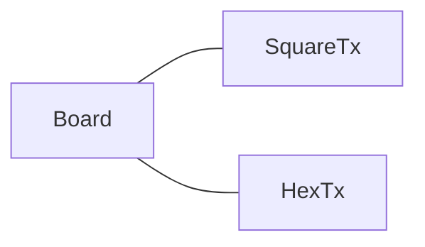
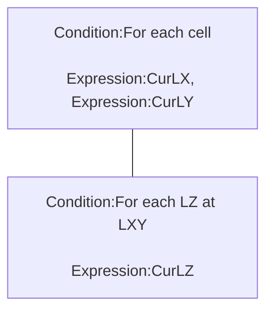
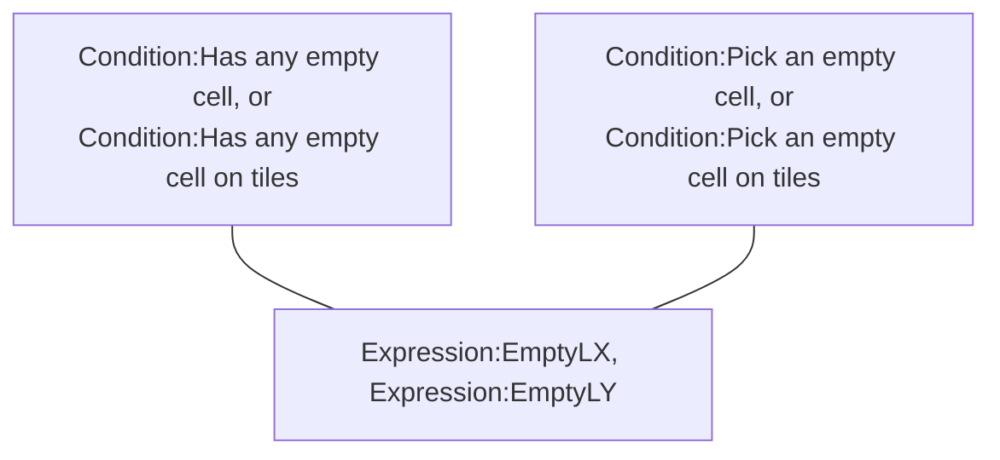
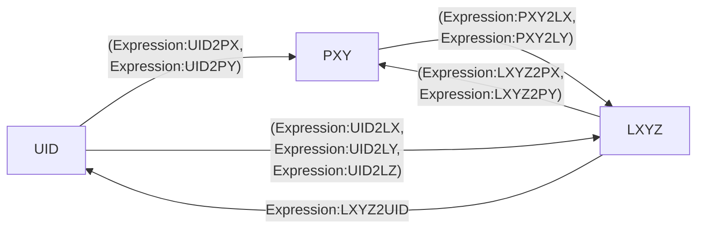

# [Categories](categories.index.html) > [Board](board.index.html) > rex_board

## Introduction

Store the logical position of chess, based plugin of my board-series plugins/behaviors.

## Links

- [Plugin](https://rexrainbow.github.io/C2RexDoc/repo/rex_board.7z)
- [ACE table](https://rexrainbow.github.io/C2RexDoc/c2rexpluginsACE/plugin_rex_board.html), 
- [Discussion thread](https://www.scirra.com/forum/plugin-board-layout2board-behavior-grid-move_t69647)

----

[TOC]

## Dependence

- [rex_board_squareTx](rex_board_squaretx.html)
- [rex_board_hexTx](rex_board_hextx.html)

## Usage

### Configure board

[Sample capx](https://onedrive.live.com/redir?resid=7497FD5EC94476E!521&authkey=!ABKjYmMcxdof4EA&ithint=file%2c.capx)

#### Setup layout

Puts one of board-layout plugin into project. Each board object should have a board-layout object.

- [rex_board_squareTx](rex_board_squaretx.html) : orthogonal/isometric/staggered layout
- [rex_board_hexTx](rex_board_hextx.html) : hexagonal layout



- `Action:Setup layout` to assign board-layout object manually

#### Size

- Property `Width` and `Height` , or `Action:Set board width`, `Action:Set board height`
  - Current size `Expression:BoardWidth`, `Expression:BoardHeight`

#### Logical position

Each chess or tile has a logical position **(x,y,z)**. Each logical position only could have one instance (chess or tile).

- x , y : number
  - index x is start from 0 to `board.width`-1
  - index y is start from 0 to `board.height`-1
- z : number or string
  - **z=0 is a tile**. It will be referenced at other plugins or behaviors.
  - others are chess.

### Create chess

- `Action:Create tile`
- `Action:Create chess`
- `Action:Create chess above tile`, or
- `Action:Fill tiles`, to fill all tiles on board

The created instance will be put at the right position directly.

- Check the properties `X at (0,0)`, `Y at (0,0)` in layout plugin ([rex_board_squareTx](rex_board_squaretx.html), or [rex_board_hexTx](rex_board_hextx.html)), if the created chess does not appear.

### Add tiles

- `Action:Add tile`
- `Action:Add chess`, or `Action:Add chess by UID`

These actions would not change the physical position of instance.

### Remove/Destroy chess

- Remove chess automatically, after instance destroyed
- Remove chess without destroying instance
  - `Action:Remove chess`
  - `Action:Remove chess by UID`
- Remove chess and destroy instance
  - `Action:Destroy chess`

### Clean board

`Action:Reset board`

### Retrieve cells

[Sample capx](https://onedrive.live.com/redir?resid=7497FD5EC94476E!2190&authkey=!AO0wKF2e8k_pwoQ&ithint=file%2ccapx)



- `Condition:For each cell` 
  - ( `Expression:CurLX`, `Expression:CurLY` ) 
- `Condition:For each LZ at LXY`
  - `Expression:CurLZ`

#### On the board

- `Condition:On the board`, returns true if the chess instance is on the board.

#### Maximum or minimum of logic X, logic Y of all chess

- Maximum LXY : (`Expression:MaxLX`, `Expression:MaxLY`)
- Minimum LXY : (`Expression:MinLX`, `Expression:MinLY`)

----

### Move chess

Move logical position of chess

- `Action:Move chess`
- `Action:Move chess by UID`
- `Action:Move chess to xyz`
- `Action:Move chess to xyz by UID`
- `Action:Move chess to z`

### Swap chess 

Swap  logical position of two chess

- `Action:Swap chess by UID`

### Kicked chess

The chess will be kicked after chess created/added/moved, since each logical position only could have one chess. 
`Condition:On chess kicked` will be triggered when chess kicking, to pick kicked chess. 
Mostly, the kicking should not happened, therefore this condition might be used for debugging during development stage.
To avoid kicking, user could assign z-index of each chess by its uid .

For example, 

````json
"#"+chess.uid
````

So that all z-index of chess will be different.

### Logical overlapping

- `Condition:Is overlapping`, returns true if chess are overlapping with the same logical (x,y) position. The z index of these chess will be different. 


- Trigger `Condition:On chess kicked`, if the z-index of these chess are the same, see previous section.

----

### Empty cell

- `Condition:Is empty`

- `Condition:Is occupied`

If a logical position is not in the board, these two conditions will return false.

### Get empty cell



[Sample capx](https://onedrive.live.com/redir?resid=7497FD5EC94476E!547&authkey=!ALfeMR4bsqOrWW8&ithint=file%2c.capx) , [Sample capx (on tiles)](https://onedrive.live.com/redir?resid=7497FD5EC94476E%212049&authkey=%21ABgmNYSj1VqJBwk&ithint=file%2ccapx)

- `Condition:Has any empty cell`, `Condition:Has any empty cell on tiles`
  - LXY of first empty cell : (`Expression:EmptyLX` , `Expression:EmptyLY`)


- `Condition:Pick an empty cell`, `Condition:Pick an empty cell on tiles`
  - LXY of a random empty cell : (`Expression:EmptyLX` , `Expression:EmptyLY`)

There has another way to pick an empty cell, see the section of `Examples` in [rex_chess](rex_chess.html).

----

### SOL

#### Pick all chess

- Pick all chess
  - `Condition:Pick all chess`, `Action:Pick all chess`
- Pick specific type of chess
  - `Condition:Pick chess`, `Action:Pick chess`

#### Pick chess according to logical position

- Pick a chess at specific LXYZ
  - `Condition:Pick chess at Logic X,Y,Z`,  `Action:Pick chess at Logic X,Y,Z`
- Pick all chess at specific LX, LY, or LZ
  - `Condition:Pick chess at LX`,  `Action:Pick chess at LX`
  - `Condition:Pick chess at LY`,  `Action:Pick chess at LY`
  - `Condition:Pick chess at LZ`,  `Action:Pick chess at LZ`
- Pick chess at specific LXY
  - `Condition:Pick chess at Logic X,Y`,  `Action:Pick chess at Logic X,Y`
  - `Condition:Pick chess inside a square`, `Action:Pick chess inside a square`

#### Pick chess above tiles

- Pick chess above based tile.
  - `Condition:Pick chess above tile`,  `Action:Pick chess above tile`

  - `Condition:Pick chess above tile UID`, `Action:Pick chess above tile UID`

    - Parameter `UID`

      - number, for single chess

      - JSON string, for multiple chess. For example,

        ```json
        "[300,301,302,303]"
        ```

        from [instance group plugin](rex_ginstgroup.html)'s `Expression:GroupToString` 

#### Pick neighbor chess

[Sample capx](https://onedrive.live.com/redir?resid=7497FD5EC94476E!551&authkey=!AMJfIWTBD5dhOWo&ithint=file%2c.capx)

- `Condition:Pick neighbor chess`, `Action:Pick neighbor chess`
  - Parameter ` Direction`
    - (-1) : all directions
    - Direction code: expressions of layout object ([rex_board_squareTx](rex_board_squaretx.html), or [rex_board_hexTx](rex_board_hextx.html))
- `Expression:DIR2UID`, get the UID of neighbor chess by origin chess and direction
- `Condition:Are neighbors (UID)`, returns true if two chess are neighbor.

----

### Physical or logical position



#### Logical position and chess UID

- UID --> LX, LY, LZ
  - `Expression:UID2LX` 
  - `Expression:UID2LY` 
  - `Expression:UID2LZ`
- LXYZ --> UID
  - `Expression:LXYZ2UID`

#### Z-index

- UID, LZ --> UID
  - `Expression:LZ2UID`, get the chess at a z-index above a chess. i.e. the same logical (x,y) but different z-index.
- LXY/UID --> amount of chess at LXY
  - `Expression:LXY2ZCn`, `Expression:UID2ZCnt`

#### Get physical position

- LXY/LXYZ/UID --> PX, PY
  - `Expression:LXY2PX`
  - `Expression:LXY2PY` 
  - `Expression:LXYZ2PX`
  - `Expression:LXYZ2PY`
  - `Expression:UID2PX`
  - `Expression:UID2PY`
- PXY --> Align PX, Align PY

  - `Expression:PXY2NearestPX`
  - `Expression:PXY2NearestPY`
- `Condition:Point is in board`, returns true if the physical position is inside board.

#### Physical position to logical position

- PXY --> LX, LY
  - `Expression:PXY2LX`
  - `Expression:PXY2LY` 

----

### Wrap

[Sample capx](https://onedrive.live.com/redir?resid=7497FD5EC94476E!988&authkey=!AHykHMNgrlyZjkc&ithint=file%2ccapx)

- Set property `Wrap` to `Yes`, or `Action:Set wrap mode`
  - The leftmost tile will become the neighbor of rightmost tile

----

### String symbol chess

[Sample capx](https://onedrive.live.com/redir?resid=7497FD5EC94476E!2186&authkey=!ABdwrpLIbniQkJg&ithint=file%2ccapx)
A chess is an instance, or replaced by a *unique string symbol* to reduce the amount of instances.

- Call `Action:Add chess by UID` to add a string symbol into this board. 
  - *DO NOT* uses symbol string which composed by number characters ( "0" - "9" ) only, these kinds of string will be used in C2 engine for UID table of instances.
- Although string symbol is not a real instance, it still could use these expressions
  - Get LXYZ by ( `Expression:UID2LX` , `Expression:UID2LY` , `Expression:UID2LZ` )
  - Get string symbol at LXYZ by `Expression:LXYZ2UID`, or `Expression:LZ2UID`
  - Get ideal PXY by ( `Expression:UID2PX`, `Expression:UID2PY` )
  - Get string symbol at PXYby `Expression:PXY2UID`

----

### Infinity board

[Sample capx](https://onedrive.live.com/redir?resid=7497FD5EC94476E!2413&authkey=!ABq8xUOuGuFpcec&ithint=file%2ccapx)
Set property `Infinity` to `Yes`

- There is no boundary (board width or board height), chess could be placed at any logic position.
- `Wrap` mode is ignored
- Some actions or conditions are not supported like `Action:Fill tiles`.

----

### Save & load

It supports official saving & loading feature.

