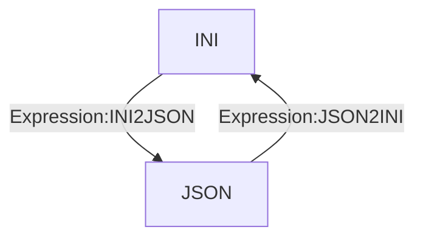

# [Categories](categories.index.html) > [Data structure](datastructure.index.html) > rex_ini

## Introduction

INI <--> JSON

Reference - [ini](https://github.com/npm/ini)

## Links

- [Plugin](https://rexrainbow.github.io/C2RexDoc/repo/rex_ini.7z)
- [ACE table](https://rexrainbow.github.io/C2RexDoc/c2rexpluginsACE/plugin_rex_ini.html)
- Discussion thread

----

[TOC]

## Dependence

None

## Usage

[Sample capx](https://1drv.ms/u/s!Am5HlOzVf0kHlWrfmD-JcEP0-fPc)

- `Expression:INI2JSON` , INI --> JSON
  - JSON : [rex_hash object](rex_hash.html), or [Yann's JSON plugin](https://www.scirra.com/forum/plugin-json-import-export-generate-edit-inspect_t100042)
- `Expression:JSON2INI`, JSON --> INI