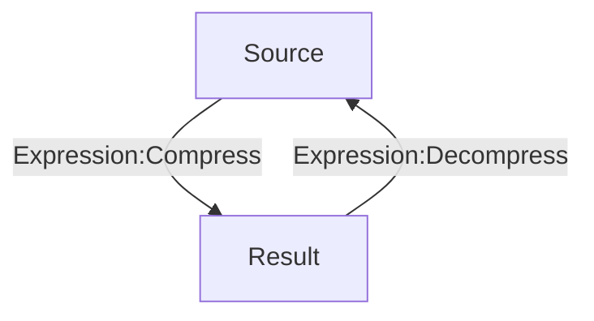

# [Categories](categories.index.html) > [String](string.index.html) > rex_lzstring

## Introduction

Compress string using LZ-based compression algorithm.

Reference - [lz-string](https://github.com/pieroxy/lz-string)

## Links

- [Plugin](https://rexrainbow.github.io/C2RexDoc/repo/rex_lzstring.7z)
- [ACE table](https://rexrainbow.github.io/C2RexDoc/c2rexpluginsACE/plugin_rex_lzstring.html)
- [Discussion thread](https://www.scirra.com/forum/plugin-lz-string-string-compression_t111122)

----

[TOC]

## Dependence

None

## Usage

### Compression and decompression

[Sample capx](https://1drv.ms/u/s%21Am5HlOzVf0kHhRtamWc-9R_WY0nN)

- `Expression:Compress` : source --> result
- `Expression:Decompress` : result --> source

### Encoding of result

[Sample capx](https://1drv.ms/u/s!Am5HlOzVf0kHlSw__xS8r6Et_wHg)

- Property `Encoding` , or `Action:Set encoding mode`
  - `None`
    - Include non-printable characters
    - Result has 1st small size
  - `Base64`
  - `UTF16`
    - Result has 2nd small size
  - `URI`