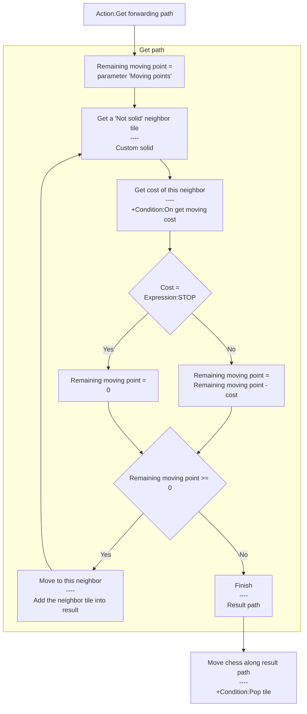
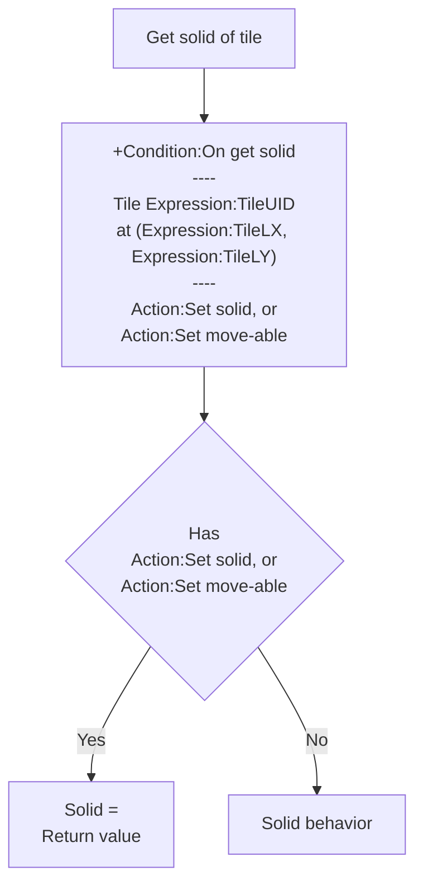
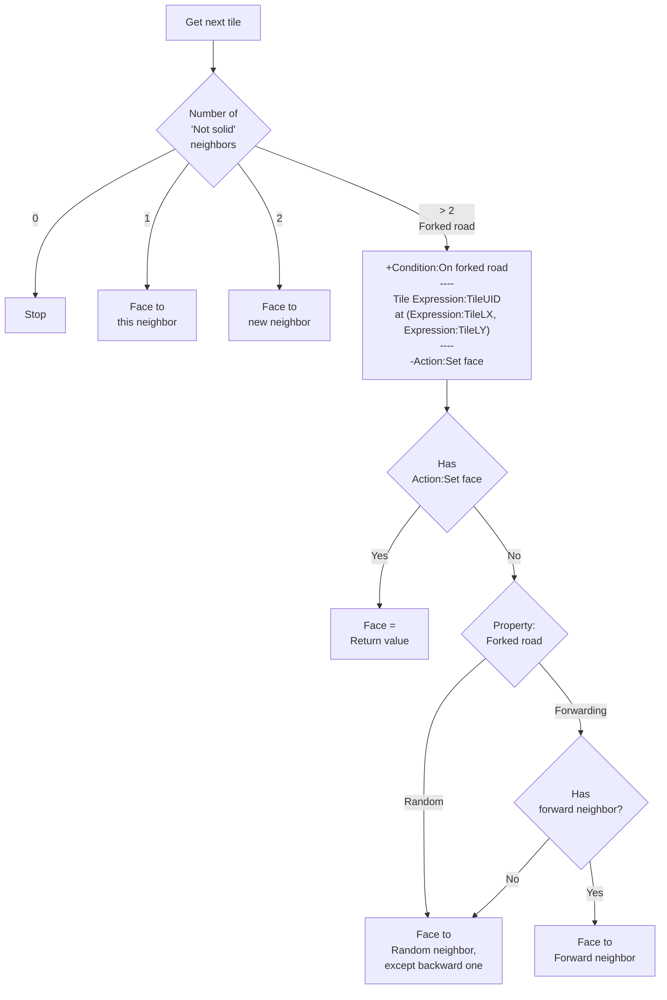
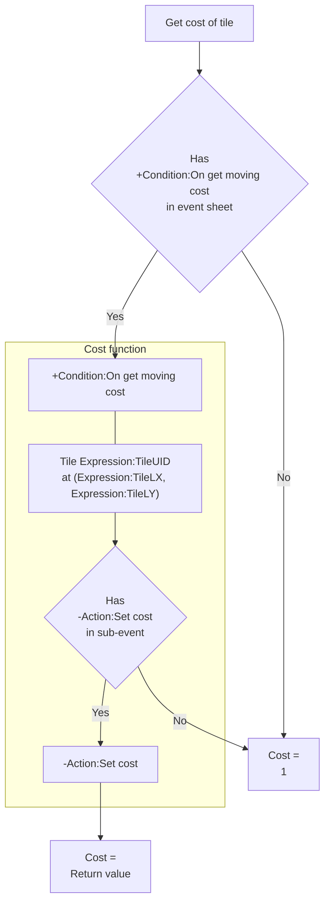
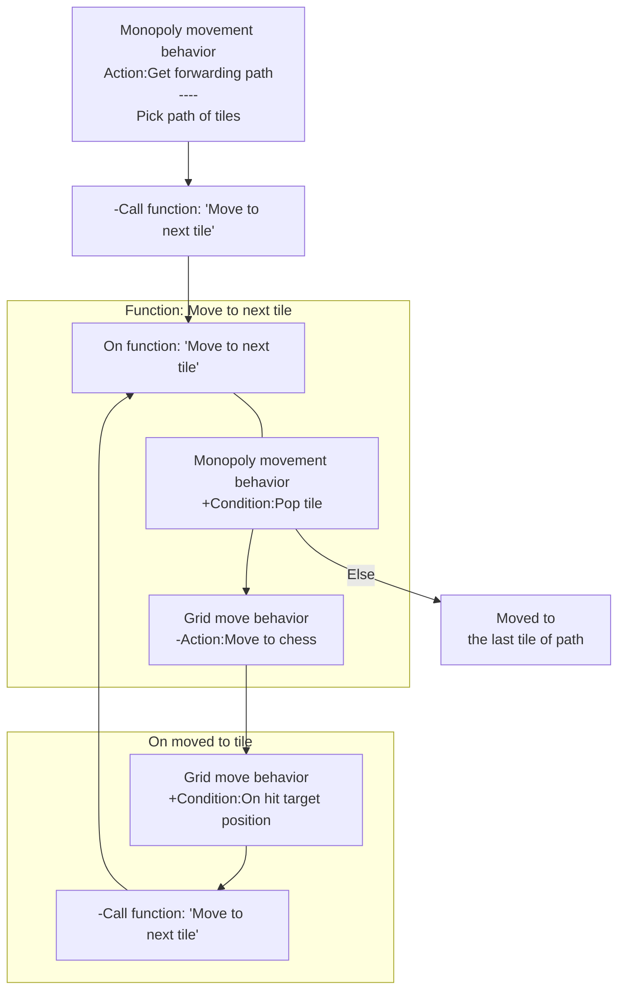

# [Categories](categories.index.html) > [Board](board.index.html) > rex_monopoly_movement

## Introduction

Get forwarding path using Monopoly-like behavior.

## Links

- [Plugin](https://rexrainbow.github.io/C2RexDoc/repo/rex_monopoly_movement.7z)
- [ACE table](https://rexrainbow.github.io/C2RexDoc/c2rexpluginsACE/behavior_rex_monopoly_movement.html)
- [Discussion thread](https://www.scirra.com/forum/behavior-monopoly-movement_t79801)


----

[TOC]

## Dependence

None

## Usage

[Sample capx](https://onedrive.live.com/redir?resid=7497FD5EC94476E!253&authkey=!AA25T4KxlYpkXNE&ithint=file%2ccapx)

### Get moving path

#### Main flow



#### Flow chart of getting solid property



#### Flow chart of getting next face (moving direction)



#### Flow chart of getting cost



Calls `Action:Get forwarding path` to get path

1. Get *Not solid* neighbors

   1. trigger `Condition:On get solid` ,
   2. pick tile `Expression:TileUID`, at LXYZ (`Expression:TileLX`, `Expression:TileLY`, 0),
   3. get custom solid by `Action:Set solid`, or `Action:Set move-able`
   4. if custom solid is NOT assigned by `Action:Set solid`, or `Action:Set move-able`, try get solid property from [official solid behavior](https://www.scirra.com/manual/104/solid).

2. Get next tile

   1. if no neighbor found

      1. stop, could not move to any tile

   2. if 1 neighbor found

      1. try move to this neighbor if remaining moving cost is enough (i.e. remaining moving cost >= 0)

   3. if 2 neighbors found

      1. try move to a new neighbor if remaining moving cost is enough, for example

      ```
      'TileA - TileB - TileC' are a sequence of tiles on the board,
      Chess move from tileA to tileB in previous step,
      now tileA and tileC are the neighbors of this step,
      Chess will try to move to tileC in this step.
      ```

   4. if more then 2 neighbors (i.e. *forked road*) found
      1. try get moving direction (face) from `Action:Set face` under  `Condition:On forked road`
         1. trigger `Condition:On forked road`
         2. pick tile `Expression:TileUID`, at LXYZ (`Expression:TileLX`, `Expression:TileLY`, 0),
         3. get new face by `Action:Set face`
         4. if new face is NOT assigned in event
            1. If property `Forked road`  is `Forwarding`
               1. if forward neighbor found
                  1. try move to forward neighbor if remaining moving cost is enough (i.e. remaining moving cost >= 0)
               2. else, pick a random neighbor, except backward one
                  1. try move to this neighbor if remaining moving cost is enough (i.e. remaining moving cost >= 0)
            2. If property `Forked road`  is `Random`
               1. pick a random neighbor, except backward one
                  1. try move to a random neighbor if remaining moving cost is enough (i.e. remaining moving cost >= 0)

`Expression:TotalMovingPoints` is the moving points input parameter of last  `Action:Get forwarding path`.

#### Get moving cost of a tile

1. if `Condition:On get moving cost` is in event sheet
   1. trigger `Condition:On get moving cost`
   2. pick tile `Expression:TileUID`, at LXYZ (`Expression:TileLX`, `Expression:TileLY`, 0),
   3. get moving cost by `Action:Set cost`
   4. if moving cost is NOT assigned in event, moving cost = 1
2. else, moving cost = 1

Set moving cost to  `Expression:STOP` will consume remaining moving cost, to stop at this tile.

#### Face

Face is the moving direction, each kind of layout ([rex_board_squareTx](rex_board_squaretx.html), [rex_board_hexTx](rex_board_hextx.html)) has different directions definition.

- Initial face is set by properties
  - Square board
    - `Face to (Square)`
  - Hexagon board
    - `Face to (Hexagon Up-Down)`, or
    - `Face to (Hexagon Left-Right)`
- Or changes face by `Action:Set face` at run-time.

### Move chess alone path

Using [rex_grid_move behavior](rex_grid_move.html) to move chess alone path after 	`Action:Get forwarding path`.

1. Get path by `Action:Get forwarding path`
2. Call C2 function *Move to next tile*

Add events of C2 function *Move to next tile* :

1. Pick next tile by `Condition:Pop tile`
2. Move to tile by `Action:Move to chess` of [grid move behavior](rex_grid_move.html)
3. chess has moved to the last tile of the path If picking nothing (`system condition:Else`)

Add events to move to next tile when reached to target tile by `Condition:On hit target position` of [grid move behavior](rex_grid_move.html)

1. Call C2 function *Move to next tile*



Sets property`Force move` to`Yes` in [grid move behavior](rex_grid_move.html), since the move-able (solid) had been determined 
by this `Action:Get forwarding path`.

`Condition:Empty` returns true after all tiles of path are popped by `Condition:Pop tile`.

### Move to last tile of path

Get the last tile instance by `Condition:Pop the last tile` to move to it, or pick this tile by LXYZ (`Expression:TargetLX`, `Expression:TargetLY`, 0). And the face at last tile is `Expression:TargetFaceDir `.