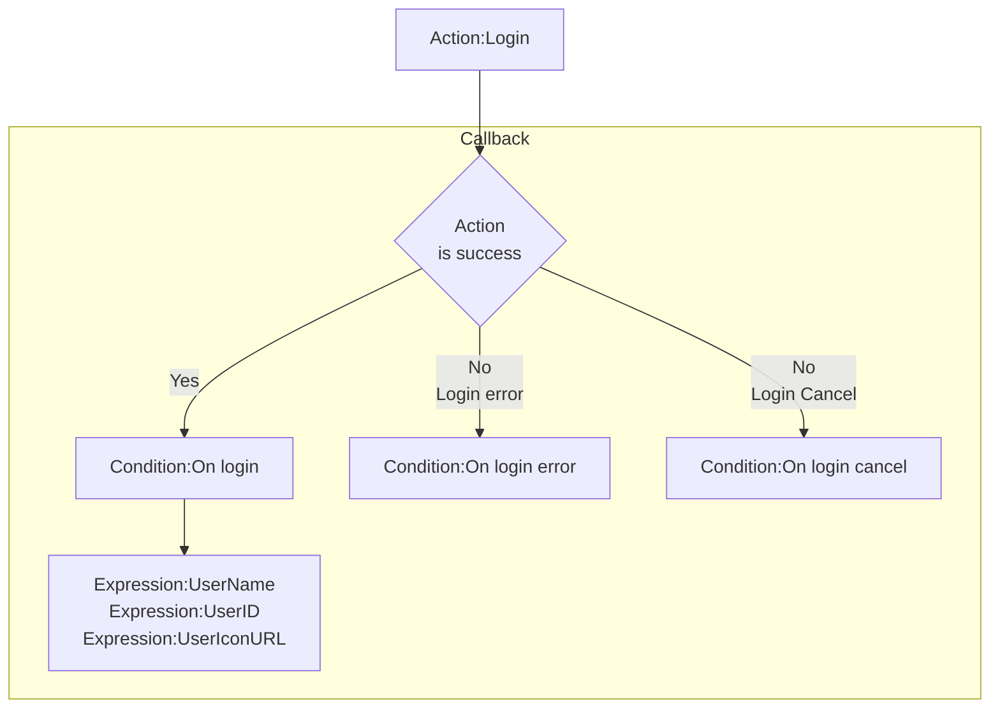
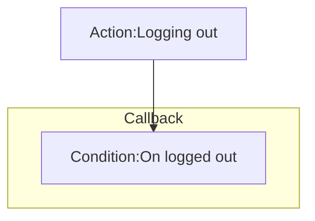

# [Categories](categories.index.html) > [Newgrounds.io](ngio.index.html) > rex_ngio_authentication

## Introduction

Authentication provided by [Newgrounds.io](http://www.newgrounds.com/). It is also a base plugin for other rex_ngio_xxxx plugins.

## Links

- [Plugin](https://rexrainbow.github.io/C2RexDoc/repo/rex_ngio_authentication.7z)
- [ACE table](https://rexrainbow.github.io/C2RexDoc/c2rexpluginsACE/plugin_rex_ngio_authentication.html)
- [Discussion thread](https://www.scirra.com/forum/plugin-new-grounds-api-v3_t179642)

----

[TOC]

## Dependence

None

## [Get started](http://www.newgrounds.io/get-started/)

## Usage

### App id and AES key

- App id : dashboard `API Tools`, `App Information` section
- AES key : dashboard `Encryption Settings`, `AES-128` section

### Logoin

[Sample capx](https://1drv.ms/u/s!Am5HlOzVf0kHk37SrpZC3Mn5oXs5)

1. Login
   - `Action:Login`
2. Callback
   - Success : `Condition:On login`
     - `Expression:UserName`
     - `Expression:UserID`
     - `Expression:UserIconURL`
       - Load icon into [image element](https://www.scirra.com/forum/viewtopic.php?t=69356&start=0)
       - Icon can *Not* load into official sprite
   - Error : `Condition:On login error`
   - Cancel :  `Condition:On login cancel`

### Logging out

1. Logging out
   - `Action:Logging out`
2. Callback
   - `Condition:On logged out`

### Debug

- Set property `Debug` to `Yes`

----

### Debug panel

User name, UserID of current user will be shown at debug panel.

