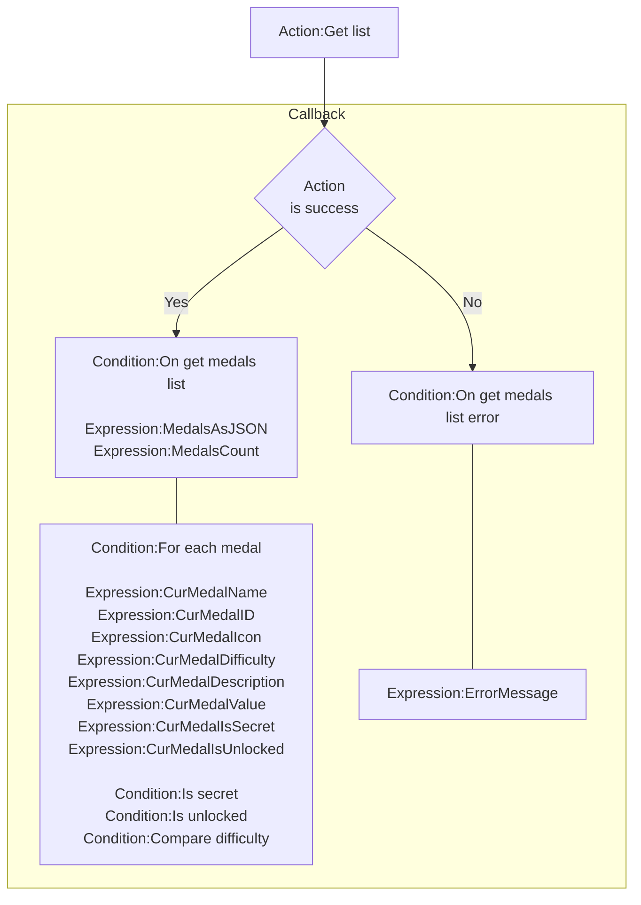
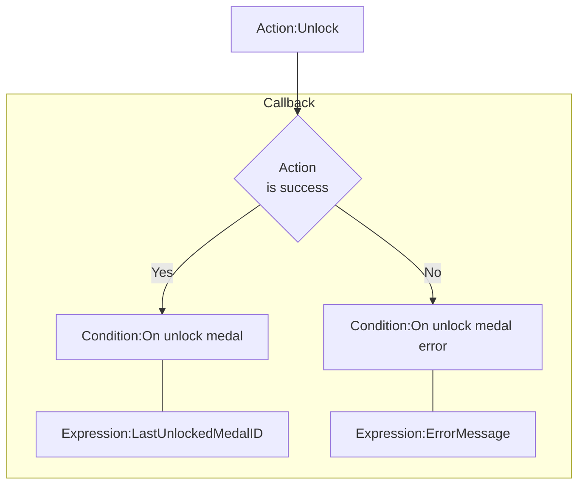

# [Categories](categories.index.html) > [Newgrounds.io](ngio.index.html) > rex_ngio_medal

## Introduction

Handles loading and unlocking of medals.

## Links

- [Plugin](https://rexrainbow.github.io/C2RexDoc/repo/rex_ngio_medal.7z)
- [ACE table](https://rexrainbow.github.io/C2RexDoc/c2rexpluginsACE/plugin_rex_ngio_medal.html)
- [Discussion thread](https://www.scirra.com/forum/plugin-new-grounds-api-v3_t179642)

----

[TOC]

## Dependence

- [rex_ngio_authentication](rex_ngio_authentication.html)

## Usage

[Sample capx](https://1drv.ms/u/s!Am5HlOzVf0kHlBLhls6hmmhouP1h)

### Prepare

Put [rex_ngio_authentication](rex_ngio_authentication.html) into project, and set property `App id` and `AES key`.

### Manage medals

Mange medals in dashboard, `API Tools`, `Medals`.

### Get list

1. `Action:Get list`
2. Callback
   - Success : `Condition:On get medals list error`
     - `Expression:MedalsAsJSON`
     - `Expression:MedalsCount`
     - `Condition:For each medal`
       - `Expression:CurMedalName`
       - `Expression:CurMedalID`
       - `Expression:CurMedalIcon`
         - Load icon into [image element](https://www.scirra.com/forum/viewtopic.php?t=69356&start=0)
         - Icon can *Not* load into official sprite
       - `Expression:CurMedalDifficulty`
       - `Expression:CurMedalDescription`
       - `Expression:CurMedalValue`
       - `Expression:CurMedalIsSecret`, returns `1` if this medal is secret
       - `Expression:CurMedalIsUnlocked`, returns `1` if this medal is unlocked
       - `Condition:Is secret`
       - `Condition:Is unlocked`
       - `Condition:Compare difficulty`
       - `Expression:LoopIndex`, index in this for each loop
     - Get medal by index
       - `Expression:Index2MedalName( index )`
       - `Expression:Index2MedalID( index )`
       - `Expression:Index2MedalIcon( index )`
         - Load icon into [image element](https://www.scirra.com/forum/viewtopic.php?t=69356&start=0)
         - Icon can *Not* load into official sprite
       - `Expression:Index2MedalDifficulty( index )`
       - `Expression:Index2MedalDescription( index )`
       - `Expression:Index2MedalValue( index )`
       - `Expression:Index2MedalIsSecret( index )`, returns `1` if this medal is secret
       - `Expression:Index2MedalIsUnlocked( index )`, returns `1` if this medal is unlocked
       - `Condition:Is secret`
       - `Condition:Is unlocked`
       - `Condition:Compare difficulty`
   - Error : `Condition:On get medals list error`
     - `Expression:ErrorMessage`

### Unlock

1. `Action:Unlock`
2. Callback
   - Success : `Condition:On unlock medal`
     - `Expression:LastUnlockedMedalID`
   - Error : `Condition:On unlock medal error`
     - `Expression:ErrorMessage`
