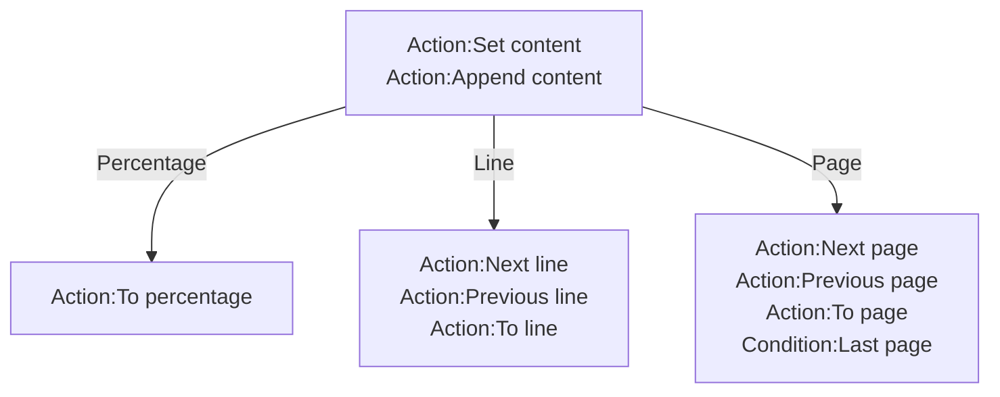

# [Categories](categories.index.html) > [Text](text.index.html) > rex_text_scrolling

## Introduction

Scroll content of text.

## Links

- [Plugin](https://rexrainbow.github.io/C2RexDoc/repo/rex_text_scrolling.7z)
- [ACE table](https://rexrainbow.github.io/C2RexDoc/c2rexpluginsACE/behavior_rex_text_scrolling.html)
- [Discussion thread](https://www.scirra.com/forum/behavior-scrolling-for-text-sprite-font-plugin_t70175)

----

[TOC]

## Dependence

- One of these plugins
  - [official text](https://www.scirra.com/manual/116/text)
  - [official sprite font](https://www.scirra.com/manual/166/sprite-font)
  - [rex_tagtext](rex_tagtext.html)
  - [rex_bbcodetext](rex_bbcodetext.html)

## Usage

1. Put this behavior under
   - [official text](https://www.scirra.com/manual/116/text)
   - [official sprite font](https://www.scirra.com/manual/166/sprite-font)
   - [rex_tagtext](rex_tagtext.html)
   - [rex_bbcodetext](rex_bbcodetext.html)
2. Set content
   - `Action:Set content`
   - `Action:Append content`
   - `Expression:Text` : content of text
   - `Expression:Lines` : string from start line to end line
3. Scroll to
   - Percentage  ([Sample capx](https://1drv.ms/u/s!Am5HlOzVf0kHgjlVjnJEr9medikG))
     - `Action:To percentage`
   - Line  ([Sample capx](https://1drv.ms/u/s!Am5HlOzVf0kHgjr2V3KH0n3AZb05))
     - `Action:Next line`
     - `Action:Previous line`
     - `Action:Tto line`
   - Page  ([Sample capx](https://1drv.ms/u/s!Am5HlOzVf0kHhB6SDGiRFZPUgfPy))
     - `Action:Next page`
       - [Sample capx](https://onedrive.live.com/redir?resid=7497FD5EC94476E!543&authkey=!AGMFvkNzNVQGiBE&ithint=file%2c.capx) : [Typing](rex_text_typing.html) text page by page
     - `Action:Previous page`
     - `Action:To page`
     - `Condition:Last page`

- Properties
  - Lines count
    - `Expression:TotalCnt` : total lines
    - `Expression:VisibleCnt` : visible lines in a page
  - Line index
    - `Expression:CurrIndex` : index of current visible line
    - `Expression:CurrLastIndex` : index of current last visible line

*DO NOT* set text in text object directly.